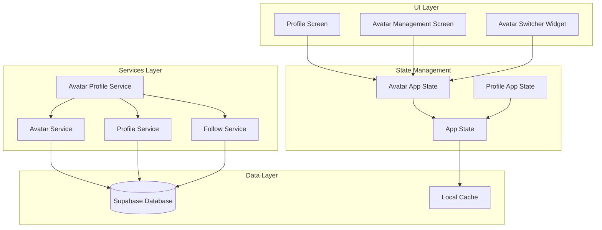
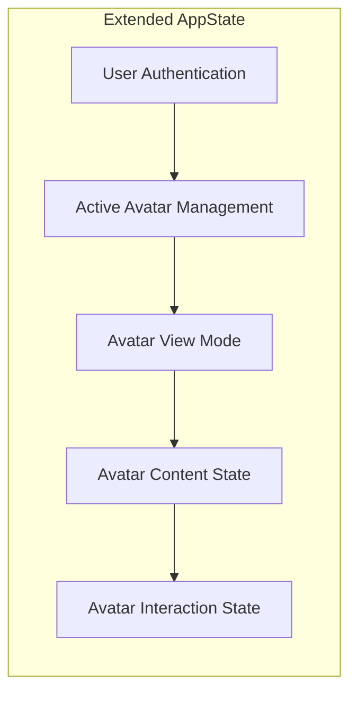

# Design Document

## Overview

This design transforms the existing user-centric profile system into an avatar-centric profile system where virtual avatars become the primary entities users interact with. The design maintains backward compatibility while introducing new concepts like active avatar management, avatar-specific content association, and dual view modes (owner vs public). The system leverages the existing AppState architecture and extends it with avatar-centric state management.

## Architecture

### High-Level Architecture



### State Management Architecture

The design extends the existing AppState with avatar-centric state management:



## Components and Interfaces

### 1. Avatar Profile Service

**Purpose:** Centralized service for avatar-centric profile operations

**Interface:**

```dart
class AvatarProfileService {
  // Avatar profile data retrieval
  Future<AvatarProfileData> getAvatarProfile(String avatarId, {bool isOwnerView = false});
  Future<List<PostModel>> getAvatarPosts(String avatarId, {int page = 1, int limit = 20});
  Future<AvatarStats> getAvatarStats(String avatarId);

  // Avatar management
  Future<void> setActiveAvatar(String userId, String avatarId);
  Future<AvatarModel?> getActiveAvatar(String userId);
  Future<List<AvatarModel>> getUserAvatars(String userId);

  // View mode determination
  ProfileViewMode determineViewMode(String avatarId, String? currentUserId);

  // Content association
  Future<void> migrateUserContentToAvatar(String userId, String avatarId);
}
```

**Key Methods:**

- `getAvatarProfile()`: Returns avatar-specific profile data with view mode considerations
- `setActiveAvatar()`: Updates user's active avatar and syncs with database
- `determineViewMode()`: Determines if user should see owner or public view

### 2. Avatar Switcher Widget

**Purpose:** UI component for switching between user's avatars

**Interface:**

```dart
class AvatarSwitcher extends StatefulWidget {
  final List<AvatarModel> avatars;
  final AvatarModel? activeAvatar;
  final Function(AvatarModel) onAvatarSelected;
  final AvatarSwitcherStyle style; // dropdown, modal, carousel
}
```

**Styles:**

- **Dropdown**: Compact selection for header areas
- **Modal**: Full-screen selection with avatar previews
- **Carousel**: Horizontal scrollable avatar cards

### 3. Enhanced Profile Screen

**Purpose:** Refactored profile screen supporting avatar-centric display

**Key Features:**

- Dynamic view mode switching (owner vs public)
- Avatar-specific content display
- Integrated avatar switcher for owners
- Avatar-specific interaction controls

### 4. Avatar View Mode Manager

**Purpose:** Manages the different view states and permissions

```dart
enum ProfileViewMode {
  owner,    // Creator viewing their own avatar
  public,   // Other users viewing the avatar
  guest     // Unauthenticated users viewing the avatar
}

class AvatarViewModeManager {
  ProfileViewMode determineViewMode(String avatarId, String? currentUserId);
  List<ProfileAction> getAvailableActions(ProfileViewMode mode);
  bool canPerformAction(ProfileAction action, ProfileViewMode mode);
}
```

## Data Models

### 1. Avatar Profile Data Model

```dart
class AvatarProfileData {
  final AvatarModel avatar;
  final AvatarStats stats;
  final List<PostModel> recentPosts;
  final ProfileViewMode viewMode;
  final List<ProfileAction> availableActions;
  final AvatarEngagementMetrics? engagementMetrics; // Owner view only
  final List<AvatarModel>? otherAvatars; // Owner view only
}
```

### 2. Avatar Stats Model

```dart
class AvatarStats {
  final int followersCount;
  final int followingCount;
  final int postsCount;
  final int totalLikes;
  final double engagementRate;
  final DateTime lastActiveAt;
}
```

### 3. Profile Action Model

```dart
enum ProfileActionType {
  follow, unfollow, message, report, share, block,
  editAvatar, manageAvatars, viewAnalytics, switchAvatar
}

class ProfileAction {
  final ProfileActionType type;
  final String label;
  final IconData icon;
  final bool isPrimary;
  final VoidCallback onTap;
}
```

## Error Handling

### 1. Avatar Loading Errors

**Scenarios:**

- Avatar not found
- Database connection issues
- Permission denied

**Handling Strategy:**

```dart
class AvatarProfileErrorHandler {
  Widget handleAvatarNotFound() => AvatarNotFoundWidget();
  Widget handlePermissionDenied() => PermissionDeniedWidget();
  Widget handleNetworkError() => NetworkErrorWidget(onRetry: _retryLoad);
  Widget handleGenericError(String error) => GenericErrorWidget(error);
}
```

### 2. State Synchronization Errors

**Scenarios:**

- Active avatar mismatch between local and remote state
- Concurrent avatar updates
- Cache invalidation issues

**Handling Strategy:**

- Implement optimistic updates with rollback capability
- Use conflict resolution for concurrent updates
- Provide manual refresh options for cache issues

## Testing Strategy

### 1. Unit Tests

**Avatar Profile Service Tests:**

```dart
group('AvatarProfileService', () {
  test('should return owner view for avatar creator', () async {
    // Test owner view mode determination
  });

  test('should return public view for other users', () async {
    // Test public view mode determination
  });

  test('should handle avatar switching correctly', () async {
    // Test active avatar updates
  });
});
```

**Avatar Switcher Widget Tests:**

```dart
group('AvatarSwitcher', () {
  testWidgets('should display all user avatars', (tester) async {
    // Test avatar list display
  });

  testWidgets('should highlight active avatar', (tester) async {
    // Test active avatar indication
  });

  testWidgets('should call onAvatarSelected when avatar tapped', (tester) async {
    // Test selection callback
  });
});
```

### 2. Integration Tests

**Profile Navigation Tests:**

```dart
group('Avatar Profile Navigation', () {
  testWidgets('should navigate to active avatar profile from tab', (tester) async {
    // Test profile tab navigation
  });

  testWidgets('should show owner view for own avatar', (tester) async {
    // Test owner view display
  });

  testWidgets('should show public view for other avatars', (tester) async {
    // Test public view display
  });
});
```

### 3. Performance Tests

**State Management Performance:**

```dart
group('Avatar State Performance', () {
  test('should handle large avatar lists efficiently', () async {
    // Test performance with many avatars
  });

  test('should cache avatar data appropriately', () async {
    // Test caching behavior
  });
});
```

## Migration Strategy

### 1. Database Migration

**Phase 1: Schema Updates**

- Add `active_avatar_id` to users table (already exists)
- Update foreign key relationships
- Create migration scripts for existing data

**Phase 2: Data Migration**

```sql
-- Create default avatars for existing users
INSERT INTO avatars (id, owner_user_id, name, bio, niche, personality_traits, personality_prompt, created_at, updated_at)
SELECT
  gen_random_uuid(),
  id,
  COALESCE(display_name, username),
  COALESCE(bio, 'Virtual influencer creator'),
  'other',
  ARRAY['friendly', 'creative'],
  'Default avatar personality prompt',
  NOW(),
  NOW()
FROM users
WHERE id NOT IN (SELECT DISTINCT owner_user_id FROM avatars);

-- Set active avatar for users without one
UPDATE users
SET active_avatar_id = (
  SELECT id FROM avatars
  WHERE owner_user_id = users.id
  LIMIT 1
)
WHERE active_avatar_id IS NULL;
```

### 2. Code Migration

**Phase 1: Service Layer Updates**

- Extend ProfileService with avatar-centric methods
- Create AvatarProfileService
- Update AppState with avatar management

**Phase 2: UI Layer Updates**

- Refactor ProfileScreen to support avatar display
- Create AvatarSwitcher component
- Update navigation logic

**Phase 3: Feature Rollout**

- Deploy with feature flags
- Gradual rollout to user segments
- Monitor performance and user feedback

## Performance Considerations

### 1. Caching Strategy

**Avatar Data Caching:**

- Cache active avatar data in AppState
- Implement LRU cache for recently viewed avatars
- Use Supabase real-time subscriptions for live updates

**Content Caching:**

- Cache avatar posts with pagination
- Implement infinite scroll with efficient loading
- Use image caching for avatar profile pictures

### 2. Database Optimization

**Query Optimization:**

```sql
-- Optimized avatar profile query
SELECT
  a.*,
  u.username as owner_username,
  COUNT(DISTINCT f.user_id) as followers_count,
  COUNT(DISTINCT p.id) as posts_count,
  AVG(p.likes_count) as avg_likes
FROM avatars a
LEFT JOIN users u ON a.owner_user_id = u.id
LEFT JOIN follows f ON f.avatar_id = a.id
LEFT JOIN posts p ON p.avatar_id = a.id
WHERE a.id = $1
GROUP BY a.id, u.username;
```

**Indexing Strategy:**

- Index on `avatars.owner_user_id` for user avatar queries
- Index on `users.active_avatar_id` for active avatar lookups
- Composite index on `posts.avatar_id, posts.created_at` for avatar posts

### 3. Real-time Updates

**Supabase Subscriptions:**

```dart
class AvatarRealtimeService {
  Stream<AvatarModel> subscribeToAvatar(String avatarId) {
    return supabase
      .from('avatars')
      .stream(primaryKey: ['id'])
      .eq('id', avatarId)
      .map((data) => AvatarModel.fromJson(data.first));
  }

  Stream<List<PostModel>> subscribeToAvatarPosts(String avatarId) {
    return supabase
      .from('posts')
      .stream(primaryKey: ['id'])
      .eq('avatar_id', avatarId)
      .order('created_at', ascending: false)
      .map((data) => data.map((item) => PostModel.fromJson(item)).toList());
  }
}
```

## Security Considerations

### 1. Access Control

**Avatar Ownership Verification:**

```dart
class AvatarSecurityService {
  Future<bool> verifyAvatarOwnership(String avatarId, String userId) async {
    final avatar = await supabase
      .from('avatars')
      .select('owner_user_id')
      .eq('id', avatarId)
      .single();

    return avatar['owner_user_id'] == userId;
  }

  Future<void> guardAvatarOperation(String avatarId, String userId) async {
    if (!await verifyAvatarOwnership(avatarId, userId)) {
      throw UnauthorizedException('User does not own this avatar');
    }
  }
}
```

### 2. Data Privacy

**View Mode Enforcement:**

- Ensure private data only shown in owner view
- Validate permissions on server side
- Implement rate limiting for profile views

**Content Filtering:**

- Apply content moderation to avatar profiles
- Implement reporting mechanisms
- Ensure GDPR compliance for avatar data

## Accessibility Considerations

### 1. Screen Reader Support

**Avatar Switcher Accessibility:**

```dart
class AccessibleAvatarSwitcher extends StatelessWidget {
  Widget build(BuildContext context) {
    return Semantics(
      label: 'Select active avatar',
      hint: 'Double tap to open avatar selection',
      child: DropdownButton<AvatarModel>(
        // Implementation with proper semantics
      ),
    );
  }
}
```

### 2. Visual Accessibility

**High Contrast Support:**

- Ensure avatar images have proper contrast ratios
- Provide alternative text for avatar images
- Support system font scaling

**Color Blind Support:**

- Use icons in addition to colors for status indicators
- Ensure sufficient contrast for all UI elements
- Provide alternative visual cues for important information
