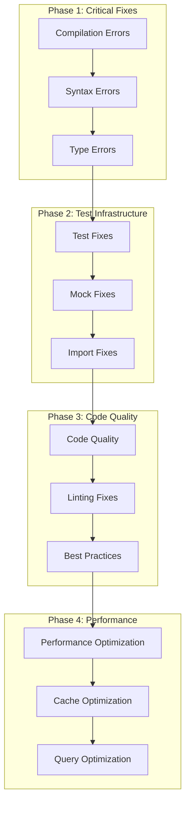
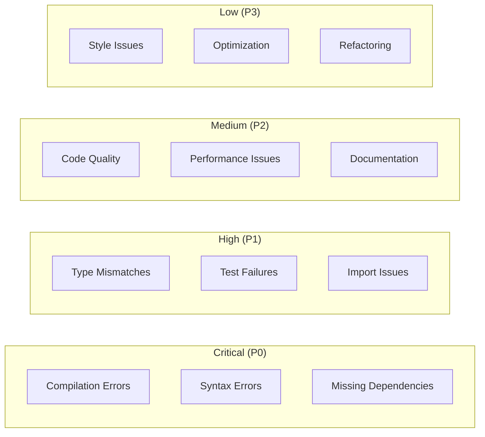
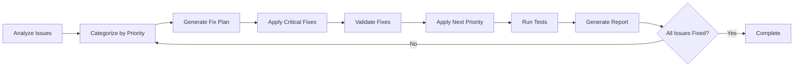

# Design Document

## Overview

This design addresses the comprehensive optimization of the Flutter social UI project by systematically resolving 1169 identified issues across syntax errors, type safety, test integrity, imports, code quality, performance, error handling, security, documentation, and CI/CD. The approach prioritizes critical compilation errors first, followed by type safety issues, then test fixes, and finally code quality improvements. The design ensures zero breaking changes while significantly improving project maintainability and performance.

## Architecture

### High-Level Optimization Strategy



### Error Classification and Priority



## Components and Interfaces

### 1. Error Analysis and Classification Service

**Purpose:** Systematically analyze and categorize all project issues

**Interface:**

```dart
class ProjectHealthAnalyzer {
  // Error analysis
  Future<List<CompilationError>> analyzeCompilationErrors();
  Future<List<TypeSafetyIssue>> analyzeTypeSafetyIssues();
  Future<List<TestIssue>> analyzeTestIssues();
  Future<List<ImportIssue>> analyzeImportIssues();

  // Quality analysis
  Future<List<CodeQualityIssue>> analyzeCodeQuality();
  Future<List<PerformanceIssue>> analyzePerformanceIssues();
  Future<List<SecurityIssue>> analyzeSecurityIssues();

  // Reporting
  Future<HealthReport> generateHealthReport();
  Future<void> exportHealthReport(String path);
}
```

### 2. Automated Fix Engine

**Purpose:** Apply systematic fixes to identified issues

**Interface:**

```dart
class AutomatedFixEngine {
  // Critical fixes
  Future<void> fixCompilationErrors(List<CompilationError> errors);
  Future<void> fixSyntaxErrors(List<SyntaxError> errors);
  Future<void> fixTypeSafetyIssues(List<TypeSafetyIssue> issues);

  // Test fixes
  Future<void> fixTestIssues(List<TestIssue> issues);
  Future<void> fixMockImplementations(List<MockIssue> issues);
  Future<void> fixImportStatements(List<ImportIssue> issues);

  // Quality fixes
  Future<void> fixCodeQualityIssues(List<CodeQualityIssue> issues);
  Future<void> optimizePerformance(List<PerformanceIssue> issues);

  // Validation
  Future<bool> validateFixes();
  Future<void> rollbackIfNeeded();
}
```

### 3. Model Consistency Manager

**Purpose:** Ensure consistent model usage across the codebase

**Interface:**

```dart
class ModelConsistencyManager {
  // Model validation
  Future<void> validateAvatarModelUsage();
  Future<void> validatePostModelUsage();
  Future<void> validateEnumUsage();

  // Model updates
  Future<void> updateModelConstructors();
  Future<void> updateEnumReferences();
  Future<void> updateParameterNames();

  // Consistency checks
  Future<List<InconsistencyIssue>> checkModelConsistency();
  Future<void> fixModelInconsistencies(List<InconsistencyIssue> issues);
}
```

### 4. Test Infrastructure Optimizer

**Purpose:** Fix and optimize the test suite

**Interface:**

```dart
class TestInfrastructureOptimizer {
  // Test fixes
  Future<void> fixTestCompilationErrors();
  Future<void> fixMockImplementations();
  Future<void> fixTestImports();
  Future<void> fixTestParameters();

  // Test optimization
  Future<void> optimizeTestPerformance();
  Future<void> improveTestCoverage();
  Future<void> standardizeTestPatterns();

  // Validation
  Future<TestResults> runAllTests();
  Future<CoverageReport> generateCoverageReport();
}
```

## Data Models

### 1. Health Report Model

```dart
class HealthReport {
  final DateTime generatedAt;
  final int totalIssues;
  final Map<IssueSeverity, int> issuesBySeverity;
  final Map<IssueCategory, int> issuesByCategory;
  final List<CriticalIssue> criticalIssues;
  final List<Recommendation> recommendations;
  final double healthScore;
  final List<String> affectedFiles;
}
```

### 2. Issue Models

```dart
enum IssueSeverity { critical, high, medium, low }
enum IssueCategory { compilation, syntax, type, test, import, quality, performance, security }

abstract class ProjectIssue {
  final String id;
  final IssueSeverity severity;
  final IssueCategory category;
  final String description;
  final String filePath;
  final int lineNumber;
  final String suggestedFix;
  final bool autoFixable;
}

class CompilationError extends ProjectIssue {
  final String errorCode;
  final String errorMessage;
  final List<String> relatedFiles;
}

class TypeSafetyIssue extends ProjectIssue {
  final String expectedType;
  final String actualType;
  final String context;
}

class TestIssue extends ProjectIssue {
  final String testName;
  final String failureReason;
  final List<String> dependencies;
}
```

### 3. Fix Result Models

```dart
class FixResult {
  final String issueId;
  final bool success;
  final String? errorMessage;
  final List<String> modifiedFiles;
  final Duration executionTime;
}

class BatchFixResult {
  final List<FixResult> results;
  final int totalFixed;
  final int totalFailed;
  final Duration totalTime;
  final List<String> rollbackActions;
}
```

## Error Handling

### 1. Fix Application Errors

**Scenarios:**

- Fix application fails
- Syntax fix introduces new errors
- Type fix breaks existing functionality
- Test fix causes test failures

**Handling Strategy:**

```dart
class FixErrorHandler {
  Future<void> handleFixFailure(FixResult result) async {
    switch (result.errorType) {
      case FixErrorType.syntaxError:
        await rollbackSyntaxFix(result);
        await applySaferFix(result);
        break;
      case FixErrorType.typeError:
        await validateTypeCompatibility(result);
        await applyGradualTypeFix(result);
        break;
      case FixErrorType.testError:
        await isolateTestIssue(result);
        await applyMinimalTestFix(result);
        break;
    }
  }
}
```

### 2. Rollback Mechanisms

**Scenarios:**

- Batch fix causes widespread issues
- Performance optimization degrades performance
- Security fix breaks functionality

**Handling Strategy:**

- Implement atomic fix operations with rollback capability
- Create file snapshots before applying fixes
- Validate fixes before committing changes
- Provide manual rollback options for complex fixes

## Testing Strategy

### 1. Fix Validation Tests

**Pre-Fix Validation:**

```dart
group('Pre-Fix Validation', () {
  test('should identify all compilation errors', () async {
    final errors = await analyzer.analyzeCompilationErrors();
    expect(errors.length, greaterThan(0));
  });

  test('should categorize issues by severity', () async {
    final report = await analyzer.generateHealthReport();
    expect(report.issuesBySeverity[IssueSeverity.critical], greaterThan(0));
  });
});
```

**Post-Fix Validation:**

```dart
group('Post-Fix Validation', () {
  test('should have zero compilation errors after fixes', () async {
    await fixEngine.fixAllCriticalIssues();
    final errors = await analyzer.analyzeCompilationErrors();
    expect(errors, isEmpty);
  });

  test('should maintain test coverage after fixes', () async {
    final coverageBefore = await testOptimizer.generateCoverageReport();
    await fixEngine.fixAllTestIssues();
    final coverageAfter = await testOptimizer.generateCoverageReport();
    expect(coverageAfter.percentage, greaterThanOrEqualTo(coverageBefore.percentage));
  });
});
```

### 2. Integration Tests

**End-to-End Fix Validation:**

```dart
group('End-to-End Fix Validation', () {
  test('should successfully build project after all fixes', () async {
    await fixEngine.applyAllFixes();
    final buildResult = await ProcessRunner.run('flutter', ['build', 'apk', '--debug']);
    expect(buildResult.exitCode, equals(0));
  });

  test('should pass all tests after fixes', () async {
    await fixEngine.applyAllFixes();
    final testResult = await ProcessRunner.run('flutter', ['test']);
    expect(testResult.exitCode, equals(0));
  });
});
```

### 3. Performance Tests

**Performance Impact Validation:**

```dart
group('Performance Impact Tests', () {
  test('should not degrade app startup time', () async {
    final startupTimeBefore = await measureAppStartupTime();
    await fixEngine.applyPerformanceOptimizations();
    final startupTimeAfter = await measureAppStartupTime();
    expect(startupTimeAfter, lessThanOrEqualTo(startupTimeBefore * 1.1));
  });

  test('should improve memory usage', () async {
    final memoryUsageBefore = await measureMemoryUsage();
    await fixEngine.applyMemoryOptimizations();
    final memoryUsageAfter = await measureMemoryUsage();
    expect(memoryUsageAfter, lessThan(memoryUsageBefore));
  });
});
```

## Implementation Strategy

### 1. Critical Path Analysis

**Phase 1: Compilation Fixes (P0)**

1. Fix syntax errors in security audit files
2. Resolve unterminated string literals
3. Fix missing semicolons and identifiers
4. Add missing dependencies to pubspec.yaml

**Phase 2: Type Safety (P1)**

1. Fix AvatarModel constructor parameter mismatches
2. Update enum usage from strings to proper enum values
3. Fix PostModel required parameter issues
4. Resolve generic type mismatches in tests

**Phase 3: Test Infrastructure (P1)**

1. Fix mock implementation inheritance issues
2. Update test imports from relative to package imports
3. Fix test parameter mismatches
4. Resolve undefined identifier issues in tests

**Phase 4: Code Quality (P2)**

1. Remove unused imports across all files
2. Replace print statements with proper logging
3. Fix regular expression syntax issues
4. Standardize code formatting and style

### 2. Automated Fix Pipeline



### 3. Risk Mitigation

**High-Risk Operations:**

- Type system changes that could break existing APIs
- Test infrastructure changes that could hide real issues
- Performance optimizations that could introduce bugs

**Mitigation Strategies:**

- Incremental fixes with validation at each step
- Comprehensive test coverage before and after fixes
- Rollback mechanisms for all automated changes
- Manual review of high-impact changes

## Performance Considerations

### 1. Fix Application Performance

**Batch Processing:**

- Process fixes in batches to avoid overwhelming the system
- Implement parallel processing for independent fixes
- Use efficient file I/O operations for large-scale changes

**Memory Management:**

- Stream large file processing to avoid memory issues
- Implement garbage collection between fix batches
- Monitor memory usage during fix application

### 2. Long-term Performance Impact

**Code Optimization:**

- Remove unused code and imports to reduce bundle size
- Optimize database queries and caching strategies
- Implement efficient data structures and algorithms

**Runtime Performance:**

- Fix performance bottlenecks identified in analysis
- Optimize widget rebuilds and state management
- Implement lazy loading and pagination where appropriate

## Security Considerations

### 1. Fix Validation Security

**Code Injection Prevention:**

- Validate all automated code changes for security implications
- Prevent injection of malicious code through fix automation
- Implement secure file handling for fix operations

**Access Control:**

- Ensure fix operations respect existing access controls
- Validate permissions before applying security-related fixes
- Maintain audit trail of all automated changes

### 2. Security Issue Resolution

**Vulnerability Fixes:**

- Prioritize security-related issues in fix pipeline
- Implement secure coding practices in all fixes
- Validate security improvements through automated testing

**Data Protection:**

- Ensure fixes don't expose sensitive data
- Maintain encryption and data protection during fixes
- Validate privacy compliance after fixes

## Monitoring and Observability

### 1. Fix Progress Tracking

**Real-time Monitoring:**

```dart
class FixProgressMonitor {
  Stream<FixProgress> monitorProgress();
  Future<void> logFixAttempt(String issueId, FixResult result);
  Future<void> generateProgressReport();
  Future<void> alertOnCriticalFailures();
}
```

### 2. Health Metrics

**Continuous Health Monitoring:**

- Track code quality metrics over time
- Monitor test coverage and success rates
- Measure performance impact of fixes
- Generate automated health reports

**Alerting:**

- Alert on fix failures or regressions
- Monitor for new issues introduced by fixes
- Track overall project health score
- Notify stakeholders of significant improvements
